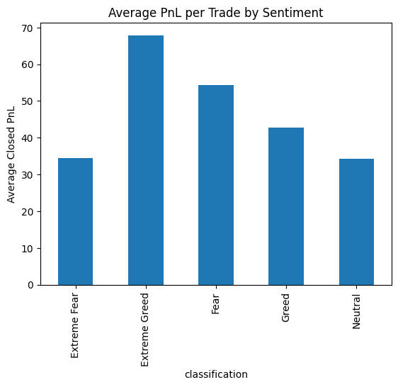
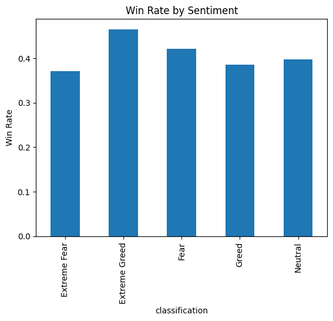
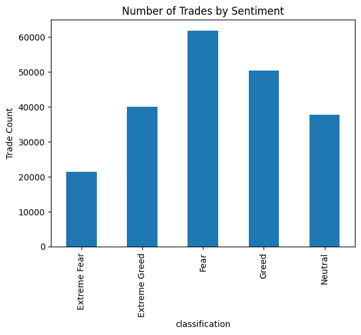

# Trader Performance vs Market Sentiment Analysis  
### Round-0 Submission – Data Science Intern  
**Candidate:** AYUSHMAN SHARMA  

---

## Objective

The objective of this project is to analyze how trader performance and behavior vary across different market sentiment regimes (Fear, Greed, Extreme Fear, Extreme Greed, Neutral).

The goal is to:
- Measure performance differences across sentiment regimes
- Identify behavioral shifts in trading patterns
- Segment traders based on risk and activity
- Propose actionable strategy recommendations

---

## Dataset Overview

- **Trades Dataset:** 211,224 rows  
- **Sentiment Dataset:** 2,644 rows  
- No duplicate trade records  
- Timestamps converted to daily level  
- Datasets merged on date after preprocessing  
- Missing sentiment values removed post-merge to ensure alignment integrity.  

---

## Methodology

### 1️. Data Preparation
- Cleaned and validated both datasets
- Converted timestamps to daily format
- Merged trade data with sentiment classification
- Verified duplicates and missing values

### 2️. Feature & Metric Engineering
Computed the following metrics:

- Average PnL per sentiment
- Win rate per sentiment
- Drawdown proxy (loss frequency)
- Trade frequency
- Average trade size
- Long/Short ratio
- Risk-adjusted return proxy (Mean PnL / Std Dev of PnL)

### 3️. Trader Segmentation
Traders segmented by:
- Frequent vs Infrequent
- High-volatility vs Low-volatility (risk profile)

---

## Key Findings

### 1. Performance Differences
- Extreme Greed regimes showed higher average PnL.
- Fear regimes exhibited higher loss frequency.
- Risk-adjusted returns varied significantly across regimes.

### 2️. Behavioral Shifts
- Trade sizes increased during Greed regimes.
- Trade frequency varied based on market sentiment.
- Long/Short positioning showed slight regime-based bias shifts.

### 3️. Trader Segmentation Insights
- Infrequent traders demonstrated higher average returns.
- High-risk traders achieved larger returns but with significantly higher variance.

---

## Sample Visualizations

### Average PnL by Sentiment


### Win Rate by Sentiment


### Trade Count by Sentiment


---

## Strategy Recommendations

**Rule 1:**  
During Fear regimes, reduce position sizing to limit potential drawdowns.

**Rule 2:**  
Increase trade frequency during Greed regimes only for historically consistent traders.

These rules aim to improve risk-adjusted performance while controlling volatility exposure.

---

## Business Impact

This analysis enables:

- Sentiment-aware trading strategy adjustments  
- Improved capital allocation across trader segments  
- Reduced downside risk during high-volatility periods  
- More stable risk-adjusted portfolio performance  

---

## Tech Stack

- Python  
- Pandas  
- NumPy  
- Matplotlib  
- Seaborn  
- Jupyter Notebook  

---

## Repository Structure

```
├── Trader_Performance_vs_Sentiment.ipynb  
├── README.md  
├── outputs/  
├── requirements.txt
```

---

## How to Run

Option 1: Using Jupyter Notebook

1. Clone the repository  
2. Install dependencies:


```bash
pip install -r requirements.txt
```


3. Open the notebook:

```bash
jupyter notebook
```

4. Run all cells sequentially  

---

Option 2: Using Google Colab

- Upload the notebook to Google Colab  
- Upload the datasets (CSV files)  
- Run all cells from top to bottom
---

## Author

AYUSHMAN SHARMA  
Aspiring Data Scientist | Python | SQL | Cloud Enthusiast
---

### Reproducibility Note

All results are fully reproducible by running the notebook sequentially from top to bottom.
Datasets should be placed in the same directory as the notebook.
